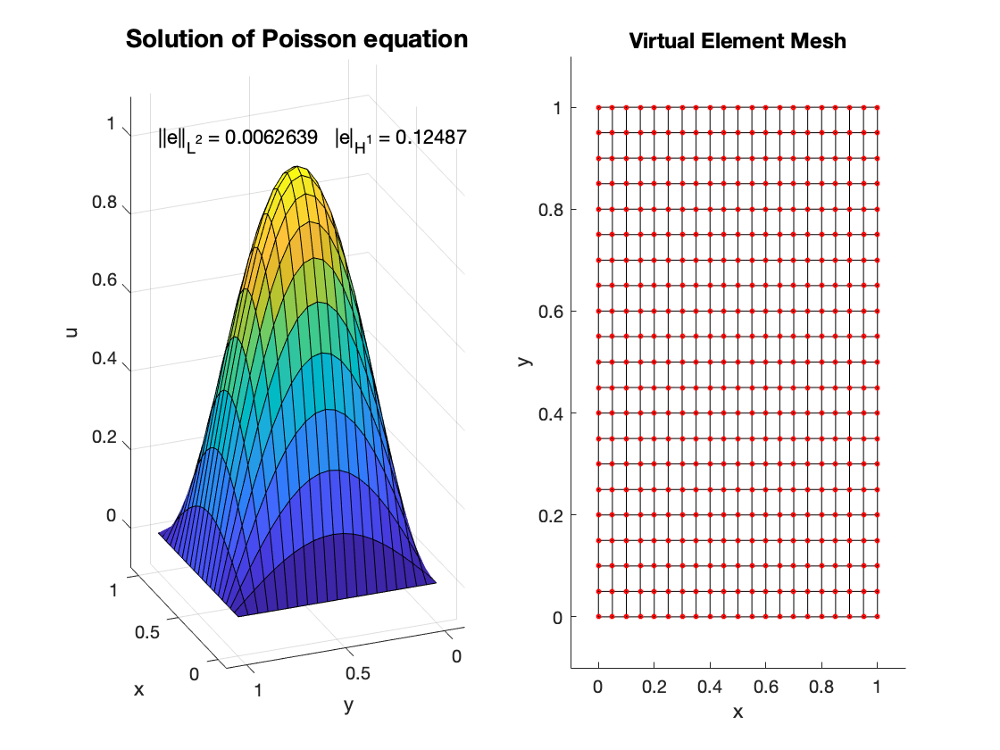
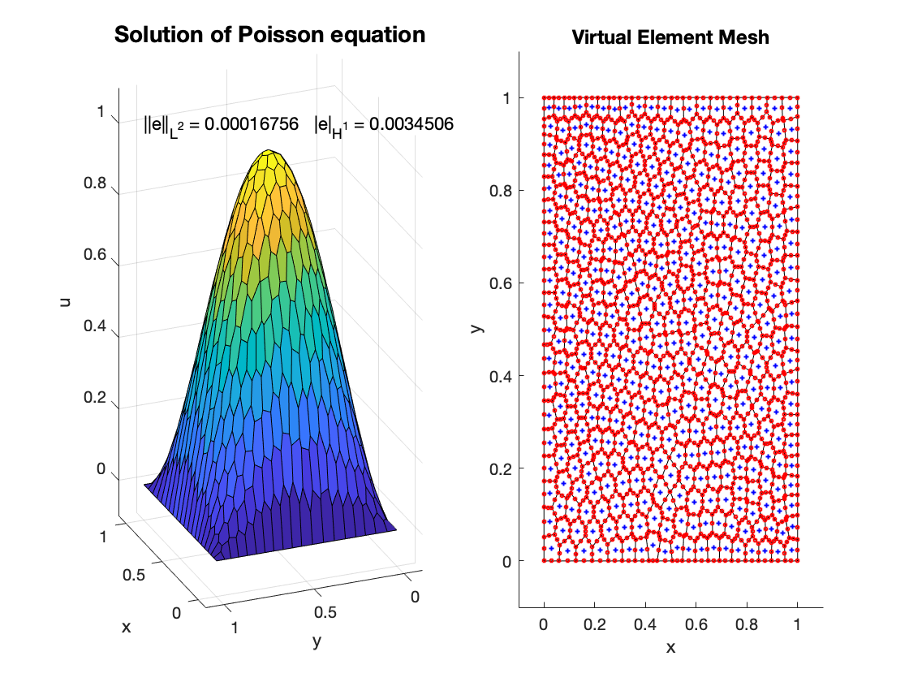
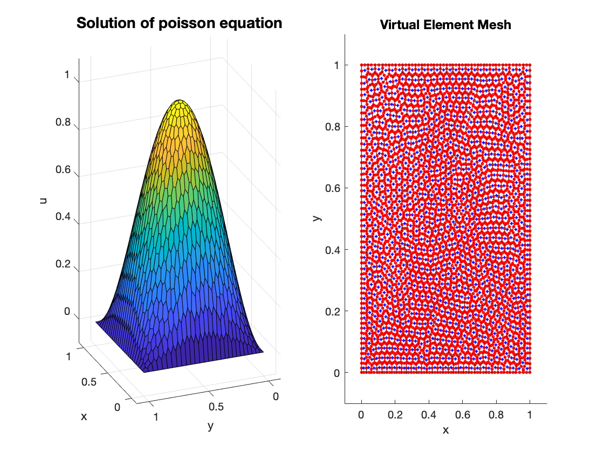
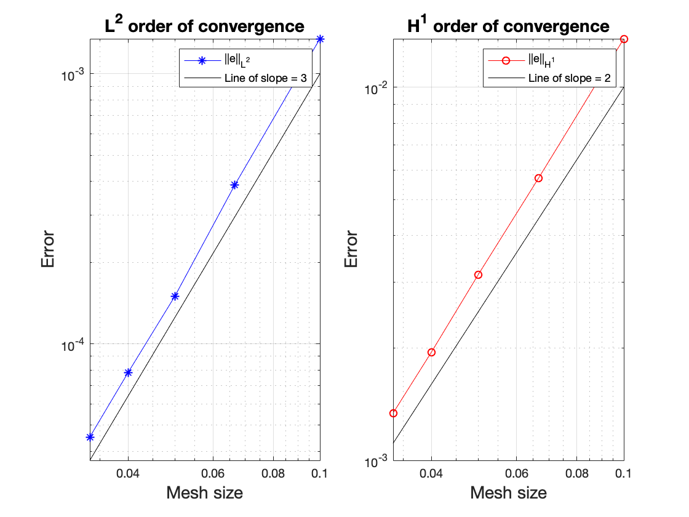
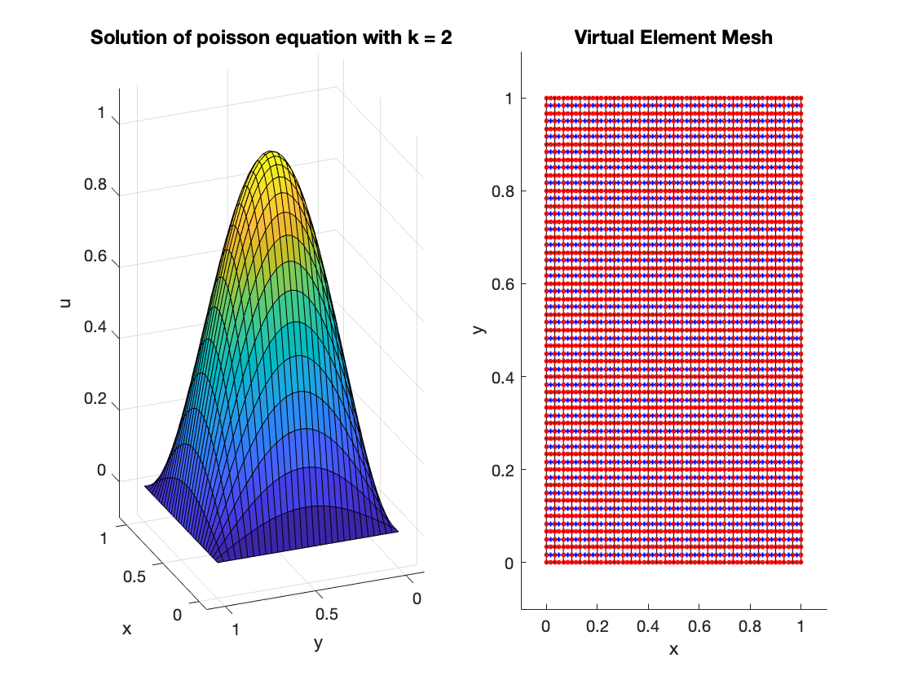
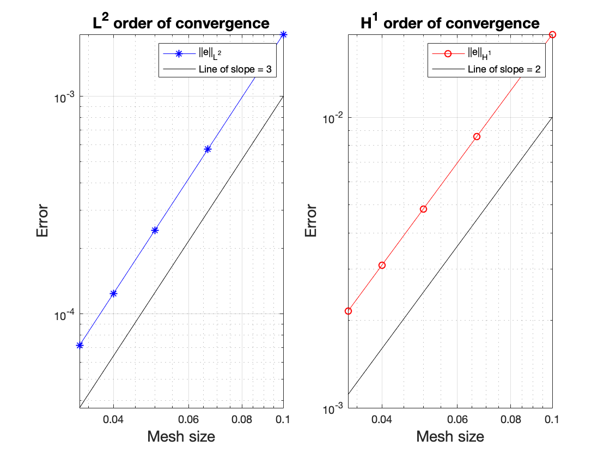

iVEM (Inspired by AFEM@Matlab) [](https://doi.org/10.5281/zenodo.4561721)

These set of codes are the first few steps to implement the Virtual Element Method in the easiest way possible.
This piece of software can be used to solve new problems without worrying about a lot of background construction regarding
mass matrix and error computation.

First prototype consisting of codes to solve simple Poisson problem, Heat equation, Benjamin-Bona-Mahony Equation.
More features will be added soon.

### How do I get set up? ###

* This code will only run on MATLAB. Before starting to use the software, add subfolders of iVEM to the default MATLAB path. To do this:
* Launch MATLAB.
* cd into the directory of iVEM.
* run startup.m
* Begin using the software.

### Example run ###
To solve the Poisson equation with a right hand side and a boundary condition:
After setting up type the following in the MATLAB command prompt.

#### For k=1
Run:
``` matlab
f = @(x,y) 2*pi^2*sin(pi*x).*sin(pi*y); % Note: The .* is a must
g_D = @(x,y) 0*x.*y; % Must input in the same form.
mesh = load('voronoi'); % Load the "Voronoi" mesh.
u = poisson(mesh,f,g_D); % Solve the problem
plot_solution(mesh,u);
[l2err, h1err] = l2error(mesh,@(x,y)sin(pi*x)*sin(pi*y),u,1,false);
```

For a prettier picture try running the example `examples/simple.m`:

||
| -- |

#### For k=2
Run:
``` matlab
f = @(x,y) 2*pi^2*sin(pi*x).*sin(pi*y); % Note: The .* is a must
g_D = @(x,y) 0*x.*y; % Must input in the same form.
mesh = load('smoothed-voronoi_quadratic');
plotmesh = load('smoothed-voronoi'); % Must input the corresponding linear mesh only.
usol = poisson_2(mesh, f, g_D);
exact = @(x,y)sin(pi*x)*sin(pi*y);
[l2err,h1err] = l2error(mesh,exact,usol,2,false);
%%% To plot, we select the solution points on the vertices only
noofvertices = length(plotmesh.vertices);
u_verts = usol(1:noofvertices);
plot_solution(plotmesh,u_verts);
```

Again, for a prettier picture try running the example `examples/simple_2.m`:

||
| -- |

#### More Examples:

More examples are provided in the `examples/` folder. For example, try running `examples/voronoi_2.m` to study the rate of convergence.

|  |  |  
-- | --

Running `examples/squares_2.m` gives the rate of convergence for squares.

|  |  |  
-- | --

To get help, simply type

``` matlab
help l2error
```
in the command prompt to know more.

### Who do I talk to? ###
* Balaje K [https://github.com/Balaje](https://github.com/Balaje),   Email: [balaje6@gmail.com](mailto:balaje6@gmail.com)
* Sanath Keshav [https://github.com/sanathkeshav](https://github.com/sanathkeshav),   Email: [sanathkeshav.mysore@gmail.com](mailto:sanathkeshav.mysore@gmail.com)
